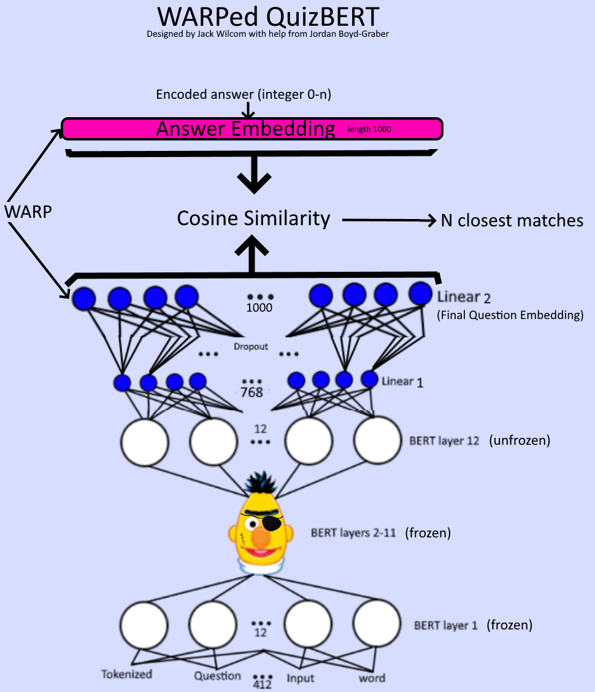

# QuizBERT - leveraging BERT to answer quizbowl questions
By Jack, Will, Charlie, and Xavier

## Introduction
This documentation is not complete, and needs to be worked on.
This project is based on the reference system - refer to the reference system documentation for more information.

This is a system designed to answer quizbowl questions using transformers bert wrapped with a linear layer to produce answer probabilities.
Refer to the diagram for more details.

Steps for training and using the system:
  - Download the necessary data files for training with the download command
  - Generate an answer vocab using the train file
  - Run the training command
  - Run the web server

## Progress report 11/19/2021

The guesser is ready to train. We are behind schedule because the original idea for combining the buzzer and guesser was infeasible. The buzzer is dependent on the guess, which makes backpropogation in a combined model not sensible. We have decided to use the pooled output vectors from BERT and some additional features from the large final output in buzzer that closely resembles the feature engineering buzzer model. 

Things left to do in development:
- Get Xavier's big computer set up booting from ubuntu with nvidia-docker for effective training - Xavier
- Get buzzer training and running - Will and Xavier
- Get data manager to chop up sentences when training to better simulate the quizbowl experience - Charlie
- Integrate the buzzer into the system - Jack
- System evaluation - Xavier
- Write-up - All
- Presentation - All

The new timeline is as follows:

● (Over Thanksgiving Break) Training our model for the first time with the qanta data.

● (Over Thanksgiving Break) Getting the new buzzer idea working, and training the buzzer.

● (11/26) Comparing model to the original tf-idf / logreg model - we hope to de better, 
but with minimal training resources, this may not turn out to be feasible in the time available.

● (11/27) Improve the model based on deliverable feedback - may include finding new
features in input to the model, extra layers to handle the output, etc.

● (12/10) Start on Final Presentation

● (12/15) Final Writeup

## Run project modules in local environment (must manually set up environment)

Run project model only
`470-BERT-Project\src>python -m qanta.ProjectModel` 

Run project data loader only
`470-BERT-Project\src>python -m qanta.ProjectDataLoader`

Run project server only - use any of the commands that you would have used in docker.
`470-BERT-Project\src>python -m qanta.ProjectServer`

## Run project in container

launch both the answer server and the evaluator
`docker-compose up`

launch just the answer server
`docker-compose up bert_qb`

download the data
`docker-compose run bert_qb ./cli download` 

trains model and saves it in specified loaction
`docker-compose run bert_qb ./cli train`  
  `--vocab_file "path to vocab file - REQUIRED"`
  `--train_file "path to data file containing train set"`
  `--data_limit [number of questions to load (defaults to all)]`
  `--epochs [number of epochs to run]`
  `--resume *flag telling system to resume from previous model file`
  `--resume_file "path to model file to resume training from"`
  `--preloaded_manager *flag telling system to load data manager from file`
  `--manager_file "path to data manager file"`

generate the answer vocab file
`docker-compose run bert_qb ./cli generate_vocab`
  `--save_location "path to save file to"`
  `--data_file "path to data file to use"`

run the model to answer questions and buzz
`docker-compose run bert_qb ./cli web`
  `--vocab_file "path to vocab file to use"`
  `--model_file "path to model file to use"`
  `--host`
  `--port`

run the model to answer questions and buzz
`docker-compose run bert_qb ./cli web`
  `--vocab_file "path to vocab file to use"`
  `--model_file "path to model file to use"`
  `--host`
  `--port`

some commands I like to use - Jack

python -m qanta.ProjectServer train --vocab_file ../data/QuizBERTSmall.vocab --train_file ../data/qanta.dev.2018.04.18.json --save_regularity 1000 --epochs 40

python -m qanta.ProjectServer web --vocab_file ../data/QuizBERTSmall.vocab --model_file ../data/QuizBERT.model

python -m qanta.ProjectServer vocab --save_location ../data/QuizBERTSmall.vocab --data_file ../data/qanta.dev.2018.04.18.json

python -m qanta.ProjectServer evaluate --vocab_file ../data/QuizBERTSmall.vocab --data_file ../data/qanta.dev.2018.04.18.json --model_file ../data/QuizBERT.model

python -m qanta.ProjectServer vocab --save_location ../data/QuizBERTCategory.vocab --data_file ../data/qanta.dev.2018.04.18.json --category_only

python -m qanta.ProjectServer train --vocab_file ../data/QuizBERTCategory.vocab --train_file ../data/qanta.dev.2018.04.18.json --category_only --save_regularity 1000 --epochs 2
